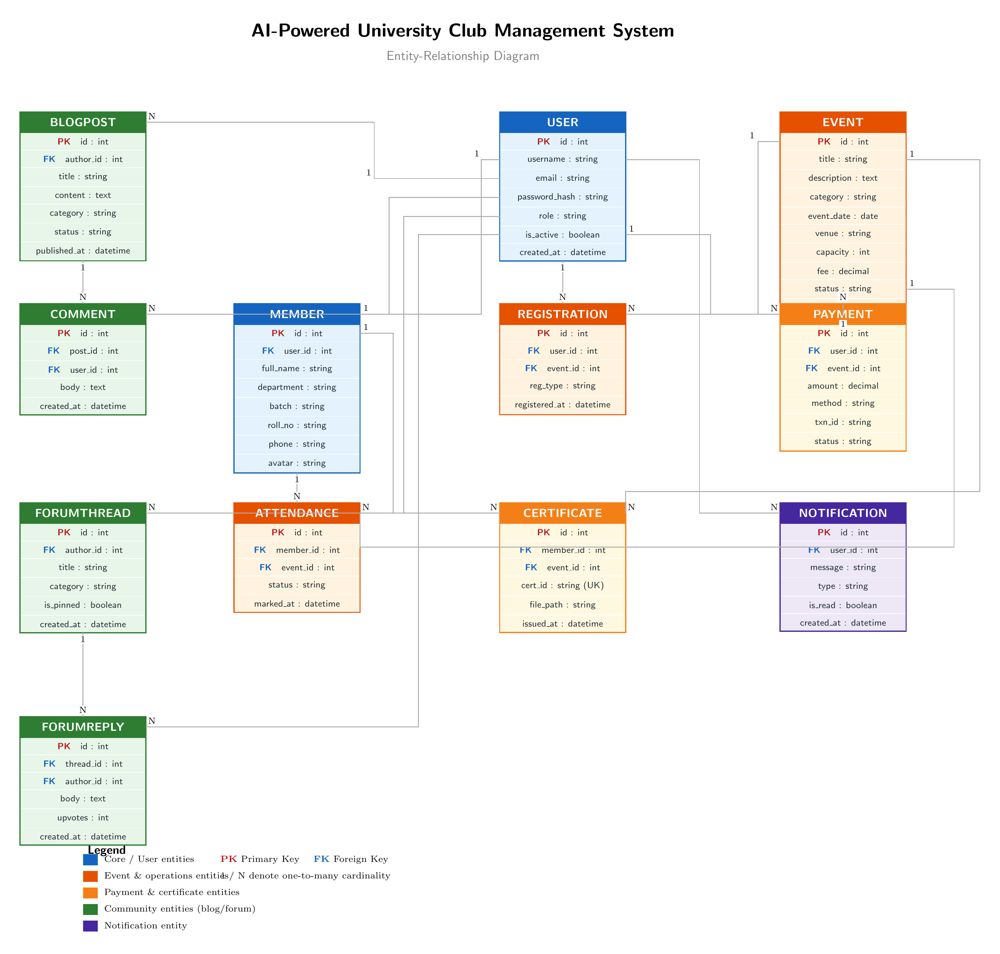
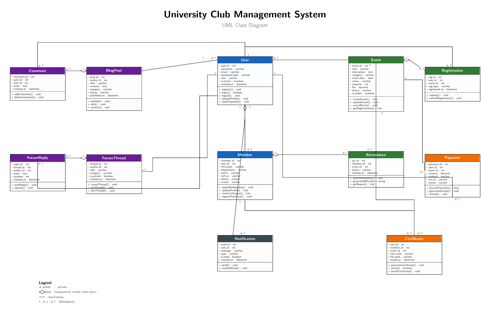

# 🎓 AI-Powered University Club Management System

<div align="center">


**A full-scale, publicly accessible web platform for managing university club operations.**

[📄 View Roadmap PDF](docs/roadmap.pdf) · [🌐 Live Demo](#) · [📋 SRS Document](docs/SRS.pdf)

</div>

---

## 📌 Project Overview

This system is more than a simple internal tool — it's a **full public-facing web platform** with:

- 🌍 **Public website** — Landing page, events listing, blog, contact
- 💳 **Online payments** — Event fees & membership dues via SSLCommerz/bKash
- 👥 **4-role access control** — Admin, Club President, Member, Guest
- 🤖 **AI content generation** — Event descriptions & blog drafts via LLM API
- 📜 **Automated certificates** — PDF generation with QR verification
- 📊 **Real-time analytics** — Role-specific dashboards with charts
- 💬 **Community features** — Discussion forum & blog with comments
- 📱 **QR attendance** — QR code-based event attendance tracking

---

## 🚀 Technology Stack

| Layer | Technology |
|-------|-----------|
| **Frontend** | HTML5, CSS3, Bootstrap 5, JavaScript ES6+ |
| **Charts** | Chart.js |
| **Rich Text** | TinyMCE / Quill |
| **Backend** | Django 4.x (Python 3.11+) |
| **Auth** | Django Allauth (Email + Google OAuth) |
| **REST API** | Django REST Framework |
| **Database** | MySQL 8.0 |
| **Payment** | SSLCommerz / bKash |
| **PDF** | ReportLab / WeasyPrint |
| **QR Code** | qrcode (Python) |
| **File Storage** | Cloudinary / AWS S3 |
| **AI** | LLM API (Claude / OpenAI) |
| **Deployment** | Render / Railway |
| **VCS** | Git & GitHub |

---

## 👥 User Roles

| Role | Access | Key Capabilities |
|------|--------|-----------------|
| 🔴 **Super Admin** | Full system | Manage all users, payments, site settings |
| 🟣 **Club President** | Club-level | Create events, approve members, manage blog/forum |
| 🟢 **Member** | Personal portal | Register for events, pay fees, download certificates |
| 🟠 **Guest** | Public pages | Browse events, read blog, register & pay for public events |

---

## 📦 System Modules

| # | Module | Description |
|---|--------|-------------|
| 1 | **Public Website** | Landing page, About, Blog listing, Contact |
| 2 | **Authentication** | Registration, Login, OAuth, Role management |
| 3 | **Member Management** | Directory, profiles, membership approval |
| 4 | **Event Management** | CRUD, public registration, seat limits, gallery |
| 5 | **Payment Gateway** | SSLCommerz/bKash, receipts, refund management |
| 6 | **Attendance** | QR code marking, reports, analytics |
| 7 | **Certificate Generation** | Auto PDF, QR verification, email delivery |
| 8 | **Blog & News** | Rich text posts, categories, comments |
| 9 | **Discussion Forum** | Threads, replies, upvotes, moderation |
| 10 | **Dashboard & Analytics** | Role-specific dashboards with Chart.js |
| 11 | **AI Features** | Event description & blog draft generator |
| 12 | **Notifications** | In-app bell, email reminders, bulk announcements |

---

## 🗓️ 11-Week Development Roadmap

| Week | Phase | Key Deliverables |
|------|-------|-----------------|
| **1** | Planning | Proposal, GitHub repo, folder structure, roadmap |
| **2** | Analysis | SRS, use cases, architecture diagram, wireframes |
| **3** | DB Design | ER diagram, relational schema, normalization |
| **4** | Foundation | Django setup, all models, migrations, admin panel |
| **5** | Auth | Registration, login, OAuth, role-based access control |
| **6** | Public + Members | Landing page, member directory, membership workflow |
| **7** | Events | Event CRUD, public registration, seat management |
| **8** | Payments + Attendance | Payment gateway, QR attendance, receipts |
| **9** | Community | Blog, forum, notifications, email system |
| **10** | AI + Certs + Dashboard | Certificates, analytics dashboard, AI integration, testing |
| **11** | Launch | Deployment, security hardening, final report, demo |

---

## 🗄️ Database Schema



See [`database/schema.sql`](database/schema.sql) for full DDL.

## 🧩 UML Class Diagram



### Core Tables

Core tables: `User`, `Member`, `Event`, `Registration`, `Attendance`, `Payment`, `Certificate`, `BlogPost`, `Comment`, `ForumThread`, `ForumReply`, `Notification`

See [`database/schema.sql`](database/schema.sql) for full DDL.

---

## 📁 Repository Structure

```
club-management-system/
├── docs/
│   ├── roadmap.pdf          ← Full project roadmap
│   ├── roadmap.tex          ← LaTeX source
│   ├── SRS.pdf
│   └── ER_Diagram.png
├── backend/
│   ├── config/              ← Django settings, urls
│   ├── accounts/            ← Auth & profiles
│   ├── members/
│   ├── events/
│   ├── payments/
│   ├── attendance/
│   ├── certificates/
│   ├── blog/
│   ├── forum/
│   ├── notifications/
│   ├── ai_features/
│   └── core/                ← Public website pages
├── frontend/
│   ├── static/
│   └── templates/
├── database/
│   ├── schema.sql
│   └── seed.sql
├── requirements.txt
├── .env.example
├── .gitignore
└── README.md
```

---

## ⚙️ Local Setup

```bash
# Clone repo
git clone https://github.com/YOUR_USERNAME/club-management-system.git
cd club-management-system

# Create virtual environment
python -m venv venv
source venv/bin/activate  # Windows: venv\Scripts\activate

# Install dependencies
pip install -r requirements.txt

# Configure environment
cp .env.example .env
# Edit .env with your MySQL credentials, secret key, API keys

# Run migrations
python manage.py migrate

# Load sample data
python manage.py loaddata database/seed.json

# Start server
python manage.py runserver
```

---

## 📄 Documentation

- 📥 [Full Roadmap PDF](docs/roadmap.pdf)
- 📝 [LaTeX Source](docs/roadmap.tex)
- 📋 SRS Document *(Week 2)*
- 🗺️ ER Diagram *(Week 3)*
- 📡 API Docs *(Week 11)*

---

## 👨‍💻 Author

**Mehedi Ashik**  
Course: Database Management Systems (DBMS) & Software Engineering (SWE)

---

*Full-Scale Web Platform Edition — Version 2.0*
